# Why vector memory is not enough

> *Vector retrieval gives you the right document. It does not tell you whether the document is still right.*

This is the gap Atlas was built to close. Vector search is excellent at the
problem it was designed for — *find me text similar to this query* — and you
should keep using it. The issue starts when a memory system has to answer a
different question: *given everything we knew, and given that one fact just
changed, what should we now believe?*

Below is one concrete worked example, then a one-paragraph generalization,
then the diagram that makes the difference visual.

---

## The example: a pricing fact changed three weeks ago

Imagine you have a memory layer behind your agent. It indexes your meeting
transcripts, your vault notes, and your decisions. The corpus contains, among
ten thousand other items, these three:

1. **Document A** *(vault note, 2026-04-08):* "ZenithPro is priced at **$2,995**.
   The Origins coffee margin claim only holds while ZenithPro is at or above
   **$2,895**."
2. **Document B** *(meeting transcript, 2026-04-26):* "Decision: ZenithPro
   moves to **$3,495** effective May 14. Sandy owns the margin re-runs."
3. **Document C** *(decision log, 2026-04-12):* "Pursued the Origins coffee
   partnership at the modeled 46% margin."

Three weeks after document B is captured, your agent gets asked: *"What's our
margin position on the Origins partnership?"*

### What a vector-memory system does

It embeds the question, runs cosine similarity, and returns the most similar
chunks. Likely top hits: **Document C** (talks about Origins margin), then
**Document A** (talks about Origins margin). Document B may or may not be in
the top-k depending on the embedding — the word "margin" is in A and C, not
in B. The agent reads C and A, sees "46% margin at $2,995," and answers
confidently.

That answer is **wrong**. It was wrong starting three weeks ago. The agent has
no way to know that, because the retriever's job ended the moment it found
relevant chunks. Nothing in the system ever asked "did anything change since
these documents were captured?"

### What Atlas does

When document B (the pricing change) was ingested, Atlas wrote a typed
`DEPENDS_ON` edge from the *Origins margin claim* (B-the-belief, sourced from
A) to the *ZenithPro price* (the property that changed). When the price
changed, `RippleEngine.propagate()` walked that edge and emitted a
`ReassessmentProposal` against the margin claim — its supporting fact had
moved, so its confidence dropped from 0.88 to 0.77 and a markdown entry was
written to the Obsidian adjudication queue:

```text
target: kref://AtlasCoffee/Beliefs/origins_margin.belief
old_confidence: 0.88
new_confidence: 0.77
reason: ZenithPro price moved from $2,995 to $3,495 (transcript dated 2026-04-26)
upstream_kref: kref://AtlasCoffee/Programs/zenithpro.price.belief
```

Three weeks later, when the agent gets asked the margin question, the system
has *already noticed* that the margin belief is suspect. The same vector
retrieval still happens, and it still returns documents A and C. But the
margin belief retrieved alongside them carries a `confidence_score = 0.77`
and a pointer to the queued adjudication. The agent can either flag the
uncertainty in its answer, or read the adjudication entry and incorporate
the resolution. **The cascade ran when the fact changed, not when the
question was asked.** That's what makes the difference between "fast
retrieval of stale belief" and "memory that knows itself."

---

## The generalization

Vector memory is *retrieval-time reasoning*: at the moment of the query, it
finds plausibly relevant text and hands it to the model. Atlas adds
*ingestion-time reasoning*: at the moment a fact changes, it walks the
typed dependency graph and updates downstream beliefs.

These are not competing — Atlas uses embeddings for retrieval too. They are
complementary layers. Vector memory is necessary; for any system whose
correctness depends on belief state staying consistent, it is not
sufficient.

---

## The diagram

```mermaid
flowchart TB
    subgraph A["Vector memory only — answers fast, but with stale state"]
        A1["Question:<br/>What's our Origins margin?"]
        A2["Embed query<br/>cosine similarity"]
        A3["Top-k:<br/>doc C (margin claim)<br/>doc A ($2,995)"]
        A4["Answer:<br/>46% at $2,995 ❌<br/>(price changed 3 weeks ago)"]
        A1 --> A2 --> A3 --> A4
    end

    subgraph B["Atlas — Ripple ran when the fact changed"]
        B1["Doc B captured:<br/>price -> $3,495"]
        B2["RippleEngine.propagate()<br/>walks DEPENDS_ON"]
        B3["Reassessment proposal:<br/>margin belief 0.88 -> 0.77"]
        B4["Adjudication queue<br/>(markdown in Obsidian)"]
        B1 --> B2 --> B3 --> B4

        B5["Question:<br/>What's our Origins margin?"]
        B6["Same vector retrieval<br/>+ current confidence_score"]
        B7["Answer:<br/>flagged uncertainty,<br/>or resolved decision ✓"]
        B5 --> B6 --> B7
        B4 -. confidence written back .-> B6
    end
```



---

## What this is not

- **Not an attack on vector databases.** Atlas's ingestion pipeline uses
  embeddings. The MCP `working_memory.assemble` tool uses embeddings.
  Atlas reads the `vault-search` daemon's BAAI/bge-base-en-v1.5 index for
  Obsidian-vault retrieval. We're not arguing against vector memory; we're
  arguing against vector memory being the *only* memory layer in systems
  whose correctness depends on belief consistency.
- **Not an attack on RAG.** RAG composes retrieval with generation. Atlas
  composes underneath both, providing belief state that retrieval can read
  alongside the embeddings. The natural place for Atlas in a RAG stack is
  as the truth-layer that retrieval reads — not as a replacement for
  retrieval.
- **Not an attack on Mem0 / Letta / Memori.** Each of those solves a
  problem worth solving. None of them propagates dependency-driven belief
  revision. If your application doesn't need belief revision, you don't
  need Atlas. If it does, you need something that does what Atlas does —
  Atlas is just one option, and we want to see more.

---

## Where to go from here

- Run [`./demo.sh`](../demo.sh) to see the cascade fire on a synthetic
  graph in 12 seconds.
- Run [`make demo-messy`](../scripts/demo_messy.py) to see the same loop
  on real-shape inputs (vault note + meeting transcript).
- Read [`docs/PROPOSAL_VS_MUTATION.md`](PROPOSAL_VS_MUTATION.md) to see
  exactly which methods can change Atlas's state and which only read.
- Read the `paper/atlas.md` draft for the formal AGM-postulate framing.

If you have a system where vector retrieval is enough — keep using it. If
you have a system where stale belief is a real failure mode, this is the
shape of the alternative.
